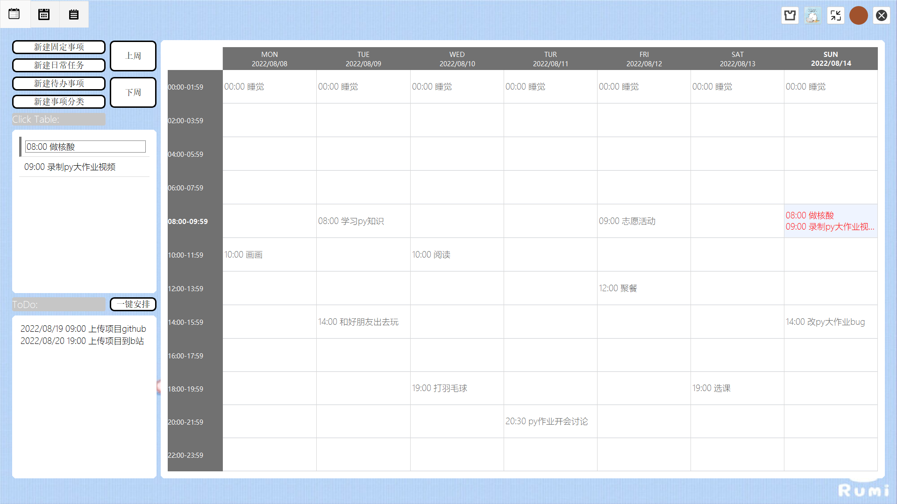
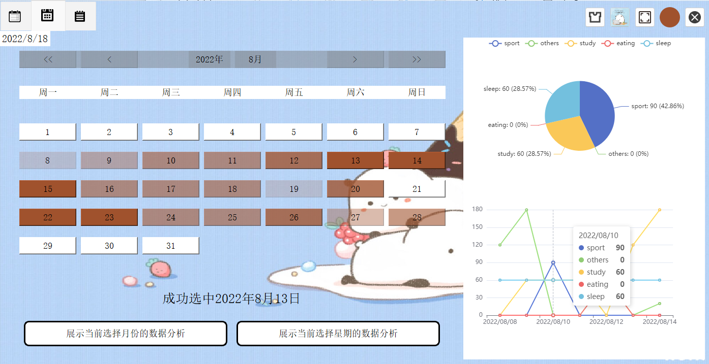
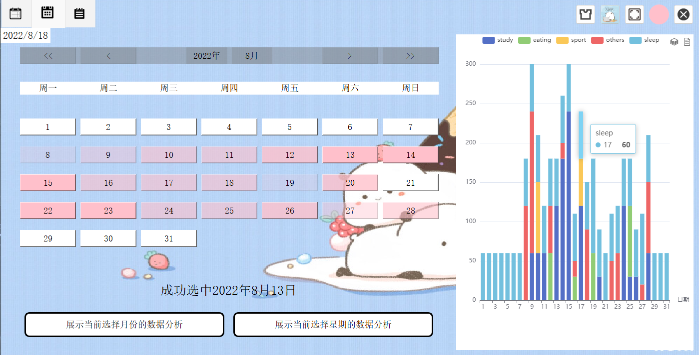

安装依赖命令：

```
pip install -r requirements.txt -i https://pypi.tuna.tsinghua.edu.cn/simple
```

启动命令：

```
python main.py
```

使用方式：

- 注册一个新账户进行登录

- 使用

  账号：test1

  密码：test1

  进行登录，里面包含三周数据（2022.8.8-2022.8.28），可以很方便地查看展示效果

展示效果：

b站视频（倍速字幕版）：https://www.bilibili.com/video/BV1ZB4y167Ps?spm_id_from=333.999.0.0







